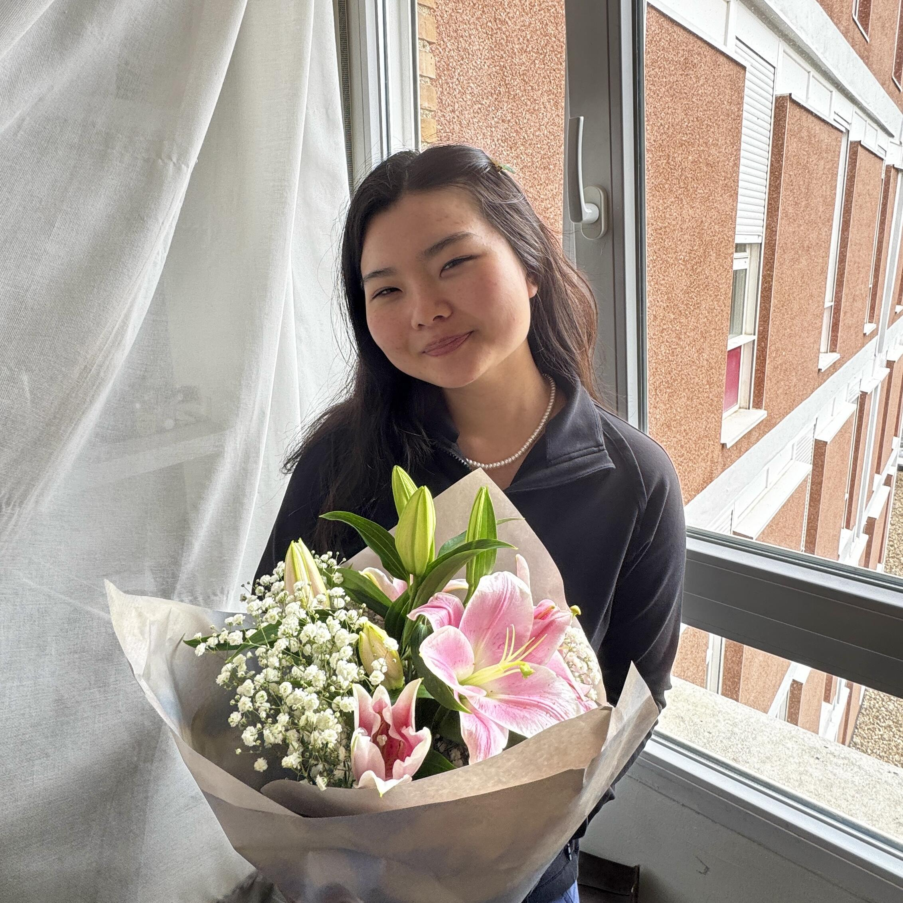

# jade zhao

  

an asian american woman in stem, learning how to turn big seasons into something gentle and good.

from indianapolis. studying in bloomington. this photo is from madrid.

summer looks quieter, but i'm still building.

someone people trust for thoughtful work, care, and calm.

this is a small archive of the work, writing, and reflections that make up my world.

---

**pages**

- [now](pages/now.md) ... where i am right now
- [pb sandwich manifesto](pages/pb-sandwich-manifesto.md) ... the throughline for everything i build
- [project brief](pages/project-brief.md) ... a consulting scoping template
- [discovery questionnaire](pages/discovery-questionnaire.md) ... intake prompts for new work
- [fall 2026 intentions](pages/fa26-intentions.md) ... what i want the next season to hold
- [figma links](pages/figma-links.md) ... design references and exports
- [madrid](pages/madrid.md) ... notes from the madrid chapter
- [notes for mentees](pages/notes-for-mentees.md) ... advice and care for students after me
- [people who shaped me](pages/people-who-shaped-me.md) ... a record of influence and gratitude
- [post grad](pages/post-grad.md) ... the page for what's next
- [reading list](pages/reading-list.md) ... books, articles, and things worth returning to
- [tools i use](pages/tools-i-use.md) ... the stack behind my work
- [values](pages/values.md) ... what i keep coming back to
- [wcag accessibility checklist](pages/wcag-checklist.md) ... a practical accessibility guide
- [year by year](pages/year-by-year.md) ... a timeline of seasons and milestones

---

**works**

- [matchaxmoxie](https://github.com/matchaxmoxie)
- [jadewowgreen](https://github.com/jadewowgreen)
- [linkedin](https://www.linkedin.com/in/jadexzhao)
- [portfolio](https://lnkd.in/eiKYqBAe)

---

*ratio. logos. ordo. praxis.*
