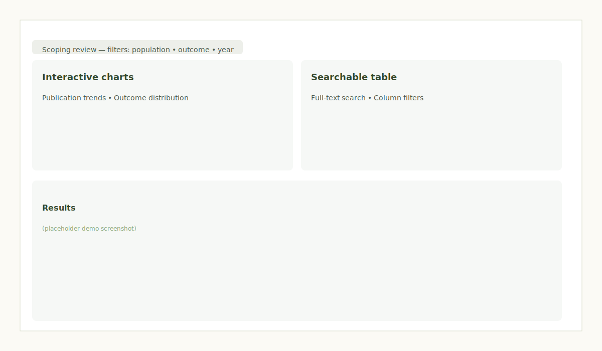

# Interactive Scoping Review Dashboard

Live demo: https://jadexzhao.github.io/jadexzhao/  (published via GitHub Pages)

A modern, accessible dashboard for analyzing and visualizing health and athlete-focused research projects. Built with React, TypeScript, and TanStack Table for advanced data management.

## Screenshot



_Replace `screenshot.svg` with an actual dashboard image to show a visual demo._

## Features

✨ **Advanced Filtering & Search**
- Multi-column filtering with real-time results
- Full-text search across project metadata
- Faceted filtering by research type, population, and outcomes

📊 **Data Visualization**
- Interactive charts with Recharts
- Research timeline views
- Outcome distribution analysis
- Publication trend visualization

♿ **Accessibility**
- WCAG 2.1 AA compliant
- Keyboard navigation support
- Screen reader optimized
- High contrast mode support

⚡ **Performance**
- Server-side pagination ready
- Optimized rendering with virtual scrolling
- Lightweight bundle size
- Responsive design

## Tech Stack

- **Frontend Framework**: React 18 with TypeScript
- **UI Components**: TanStack Table (React Table), Lucide Icons
- **Data Visualization**: Recharts
- **Styling**: Tailwind CSS
- **Build Tool**: Vite
- **Type Safety**: TypeScript 5

## Getting Started

### Prerequisites
- Node.js 16+
- npm or yarn

### Installation

```bash
npm install
```

### Development

```bash
npm run dev
```

Opens at `http://localhost:5173`

### Build

```bash
npm run build
```

## Project Structure

```
src/
├── components/
│   ├── Charts.tsx       - Data visualization components
│   ├── DataTable.tsx    - Advanced filterable data table
│   └── Filters.tsx      - Filter UI components
├── data/
│   └── projects.json    - Research project dataset
├── App.tsx              - Main application component
├── main.tsx             - React entry point
└── index.css            - Global styles
```

## Data Format

The dashboard expects research project data in the following structure:

```json
{
  "id": "proj-001",
  "title": "Project Title",
  "authors": ["Author Name"],
  "year": 2024,
  "type": "RCT|Observational|Qualitative",
  "population": "Students|Athletes|General",
  "focus": ["intervention", "outcome"],
  "outcomes": ["health", "engagement", "performance"],
  "sample_size": 150,
  "impact": "+45% engagement"
}
```

## Key Features Explained

### TanStack Table Integration
- Server-side ready pagination
- Column sorting and visibility toggling
- Global and column-specific filtering
- Dynamic column configuration

### Chart Components
- Research timeline analysis
- Outcome distribution by type
- Publication trend tracking
- Population demographic views

### Responsive Design
- Mobile-first approach
- Tablet and desktop optimizations
- Flexible grid layout
- Touch-friendly interactions

## Performance Considerations

- Lazy loading of chart data
- Memoized components for large datasets
- Efficient re-render optimization
- CSS-in-JS minimization with Tailwind

## Browser Support

- Chrome/Edge: Latest 2 versions
- Firefox: Latest 2 versions
- Safari: Latest 2 versions
- Mobile browsers: iOS Safari 12+, Chrome Mobile

## Contributing

This is a portfolio project showcasing full-stack development practices including data visualization, accessibility, and modern web performance optimization.

## License

Personal portfolio project - 2024
